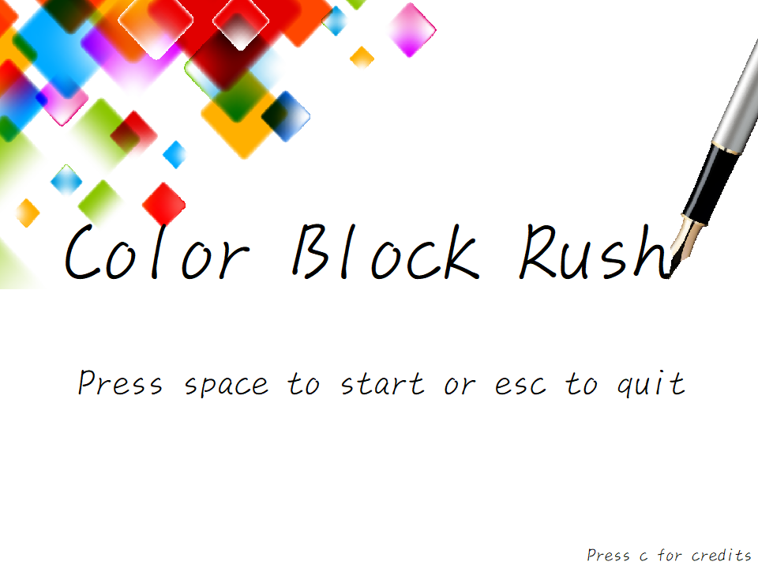
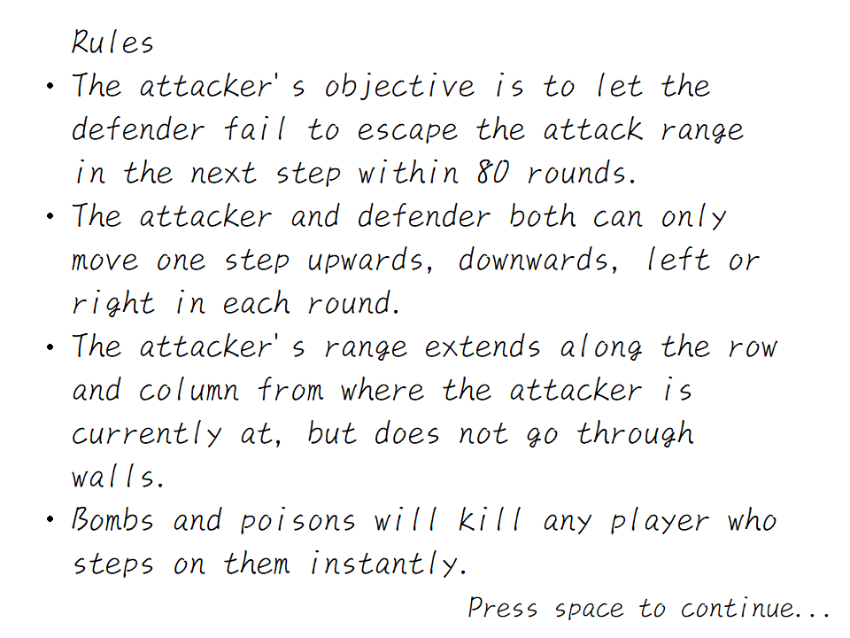
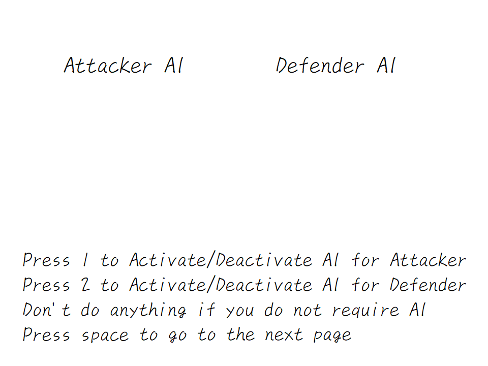
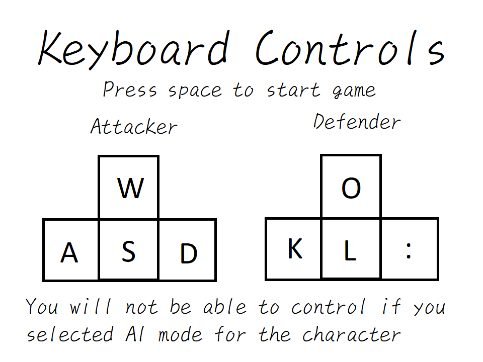
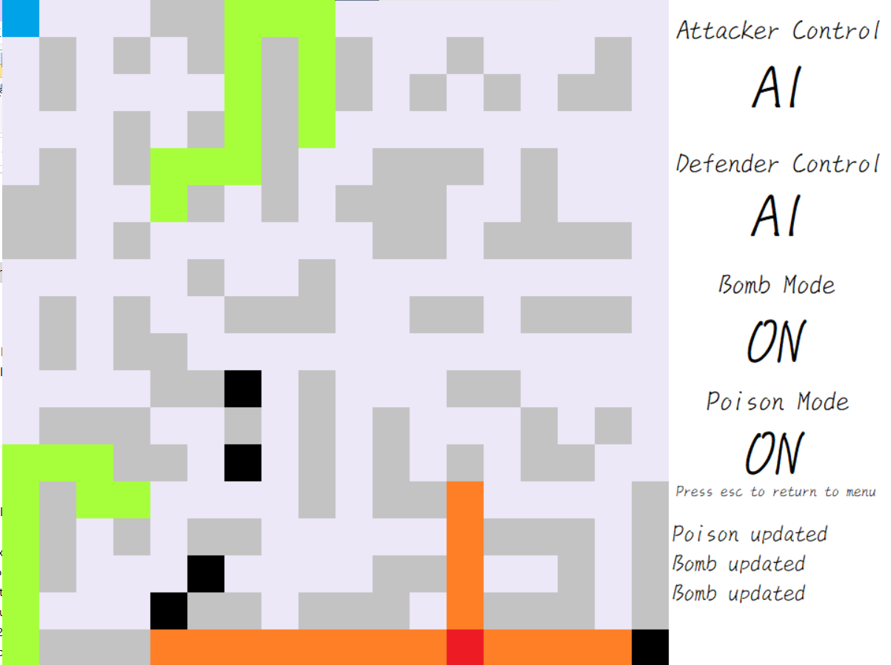
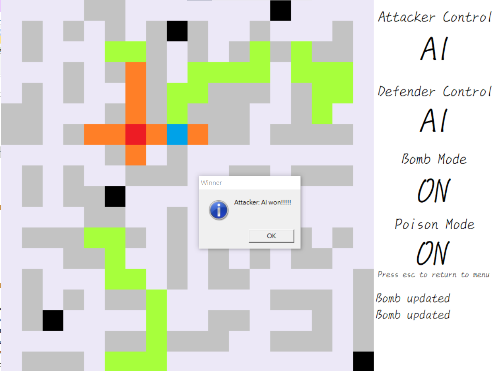

# Color Block Rush
This is a game that originated from chess engames containing a rook and a king, with some enhancements. For complete specifications, please refer to report-1.pdf and report-2.pdf

Note: Archived project, originally built as a final project for Computer Programming in 2019 by Rui-Siang Lin, Hua Fan, and Mu-En Li

## Compile(Windows only)
```
make
```
## Screenshots






